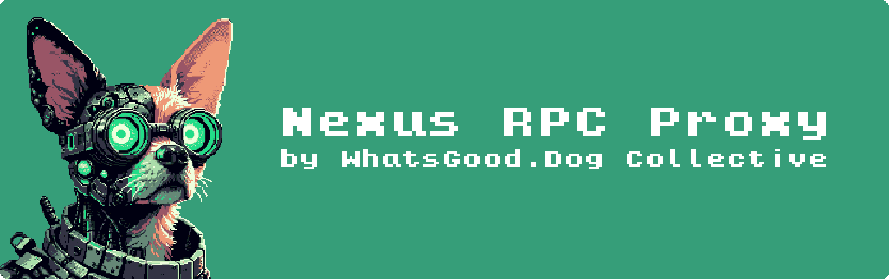

<div align="center">



<div>


<a href="https://nexus.whatsgood.dog/" target="_blank"></a>
<a href="https://github.com/whats-good/nexus/graphs/commit-activity" target="_blank"></a>
<a href="#" target="_blank"></a>

</div>

<div>


  <!--  -->

</div>

</div>

## Introduction

Welcome to `Nexus` - a simple TypeScript proxy server for any [Ethereum JSON RPC](https://ethereum.org/en/developers/docs/apis/json-rpc/) compliant blockchain. Instead of connecting your dApps to a blockchain node, you can connect them to `Nexus` and `Nexus` serves the requests for you. `Nexus` is open source and free to use.

## Documentation

Check out our [documentation](https://nexus.whatsgood.dog) for detailed instructions.

## Installation

```sh
# npm
npm install @whatsgood/nexus

# pnpm
pnpm install @whatsgood/nexus

# yarn
yarn add @whatsgood/nexus

```

## Quickstart

```ts
// node.js standalone server example

import { Nexus, NodeProvider, CHAIN } from "@whatsgood/nexus";
import { createServer } from "node:http";

const alchemyNodeProvider = new NodeProvider({
  name: "alchemy",
  chain: CHAIN.ETHEREUM_MAINNET,
  url: process.env.ALCHEMY_URL,
});

const infuraNodeProvider = new NodeProvider({
  name: "infura",
  chain: CHAIN.ETHEREUM_MAINNET,
  url: process.env.INFURA_URL,
});

const nexus = Nexus.create({
  nodeProviders: [alchemyNodeProvider, infuraNodeProvider],
  port: 4005,
  log: { level: "debug" },
  relay: {
    failure: {
      kind: "cycle-requests",
      maxAttempts: 3,
    },
    order: "random",
  },
});

createServer(nexus).listen(nexus.port, () => {
  console.log(`🚀 Server ready at http://localhost:${nexus.port}`);
});
```

## Interaction

In this example, since we have configured the server to connect to `Ethereum Mainnet`, we supply the chain id = `1` as the endpoint.

```bash
curl \
    -X POST http://localhost:4005/1 \
    -H "Content-Type: application/json" \
    -d '{"jsonrpc":"2.0","method":"eth_blockNumber","params":[],"id":1}'

```

<!-- TODO: remove the nexus/README.md from version control, and only generate it pre npm publish -->
